# VertKleen product and service market-conversion opportunities

**Date:** 2026-07-27
**Scope:** remaining refinement opportunities after P2 conversion work and P3 case-summary, authority-article, and exact-product certification/equivalency work
**Public brand:** VertKleen

## Executive decision

The next useful work is not another evidence system or another product name. It is
better differentiation and routing across the 15 existing `/Products` pages and the
existing service catalog.

Highest-value remaining sequence:

1. **Differentiate high-intent product pairs**: VertKleen CIP CR vs VertKleen HVAC
   CR; VertKleen CIP HCR vs VertKleen HVAC HCR vs VertKleen Descaler; VertKleen CR
   HD vs VertKleen CR HD Low Foam.
2. **Turn generic sample CTAs into job-scoping CTAs** while preserving the existing
   quote form, five request types, API, persistence, CRM, admin, and notification
   path.
3. **Expose the right approved proof beside the right product** instead of sending
   most products only to the generic proof hub.
4. **Market services by the decision they resolve**, not by a 35-line SKU list:
   diagnose the deposit, prove a wash or cycle, define a water-management plan, or
   prepare a bid decision.
5. **Add application imagery, not more bottle renders.** Current product-page image
   coverage is complete at the packshot level but thin at the job, method, and
   outcome level.

No new schema, standalone evidence page, parallel intake form, or new route is needed
for these opportunities.

Implementation status from this pass:

- P4.1 complete: all 15 pages now use authoritative names, distinct job scope,
  exact-product sample labels, and job-first quote actions;
- P4.2 complete for proven mappings: exact-product authority records remain limited
  to VertKleen CIP CR, VertKleen HVAC CR, and WaterSafe60; seven products also
  deep-link only generic-slug result summaries that match their current public job;
- P4.3 complete: all 35 service lines and four packages use shared category
  decision copy, deliverable detail, CTA routing, and one WMP lifecycle sequence;
- P4.4 review complete: 15 equipment-only representative assets passed visual and
  claim-boundary review, use the managed-image manifest and CMS path, and cover all
  15 product pages plus the selected service contexts.

## Current inventory and real gaps

### Product scope

The authoritative public set is the 15 names already used in `/Products`:

- VertKleen CIP CR
- VertKleen HVAC CR
- VertKleen CIP HCR
- VertKleen HVAC HCR
- VertKleen Descaler
- VertKleen CR HD
- VertKleen CR HD Low Foam
- VertKleen Neutral
- VertKleen MultiWash
- VertKleen LAM3
- Purgo
- VertKleen AlumiBrite
- VertKleen Torque
- VertKleen SAR
- WaterSafe60

Do not expand this work to CRS, DBNPA, glycols, or other catalog-only/internal
entries. They do not have an authoritative `/Products` page in the current public
set.

Current controlled-document and proof coverage:

| Existing product | Current strong coverage | Remaining conversion gap |
|---|---|---|
| VertKleen CIP CR | Six controlled records; brewery results; exact source-versioned equivalency record | Lead with CIP job conditions and completed-cycle economics; deep-link approved brewery and exact-product records |
| VertKleen HVAC CR | One controlled user guide; exact source-versioned equivalency record | Public CTA says “CR2” although authoritative public name is VertKleen HVAC CR; explain HVAC/drain job boundary and use public name in CTA |
| VertKleen CIP HCR | Seven controlled records; brewery, rust, and pool-filter results | Distinguish brewery CIP from HVAC HCR and Descaler; ask for scale type, metallurgy, loop volume, and endpoint |
| VertKleen HVAC HCR | Product page and packshot; HCR-family context | No exact T16/HVAC HCR controlled record found in current ledger; avoid transferring CIP HCR claims and build a bulk-HVAC scope request |
| VertKleen Descaler | Four controlled records; fire-system and AC-coil result summaries | Clarify when buyer should choose Descaler instead of either HCR product |
| VertKleen CR HD | Four controlled records; kitchen, distribution, and equipment summaries | Convert broad degreaser positioning into soil loading, passes, rinse, downtime, and wash-water questions |
| VertKleen CR HD Low Foam | Public page; reused CR HD packshot | No exact Low Foam controlled record, distinct image, or direct result summary found; prove machine/foam distinction before expanding claims |
| VertKleen Neutral | Three controlled records | No current public result summary; focus on substrate, finish, seal, and test-patch decision rather than broad “safe for” language |
| VertKleen MultiWash | Three controlled records; exterior/drone-wash summary | Broad job set risks “one cleaner for everything”; separate facility-floor, pressure-wash, and mixed-soil entry points |
| VertKleen LAM3 | Four controlled records; property-surface summary | Add substrate/stain/weather/runoff questions; avoid universal exterior or landscape claims |
| Purgo | Six controlled records including technical tests | No current public result summary; antimicrobial wording is regulated and must remain exact-label bounded |
| VertKleen AlumiBrite | Packshot; approved marine result summary | No exact controlled SKU record found; keep conversion around aluminum type, finish, test patch, and contained wash |
| VertKleen Torque | Three controlled records; approved vessel-wash summary | Replace branded-vessel/customer implications with generic documented vessel-wash context |
| VertKleen SAR | Three controlled records | Positioning remains too abstract; require deposit, metallurgy, sample/coupon, and procedure before promising fit |
| WaterSafe60 | Five controlled records; exact source-versioned NSF/ANSI/CAN 60 record | Strongest authority opportunity; keep certification limited to listed functions/use levels and connect it to system-specific water-program review |

VertKleen CIP CR, VertKleen HVAC CR, and WaterSafe60 receive direct exact-product
authority links. VertKleen CIP CR, VertKleen CIP HCR, VertKleen Descaler, VertKleen
CR HD, VertKleen LAM3, VertKleen AlumiBrite, and VertKleen Torque also receive only
their scope-matched generic-slug result links. HVAC HCR, CR HD Low Foam, Neutral,
MultiWash, Purgo, SAR, and every other unmapped variant remain unlinked rather than
inheriting family proof.

### Visual scope

The managed image registry contains a packshot for every authoritative product page.
That is good catalog coverage, not complete sales coverage.

Remaining visual gaps:

- every product page uses one packshot as its only product-specific visual;
- VertKleen CR HD Low Foam reuses the VertKleen CR HD image and has no distinct
  Low Foam asset;
- several alternate CR HD and MultiWash label renders exist but do not show the
  buying job or method;
- service marketing uses two images for 35 line items and four packages;
- approved field images are concentrated in proof, not connected visibly to the
  relevant product decision.

Generate job/method visuals only where they help a buyer identify the right scope.
Never generate a before/after result and present it as evidence.

## Prioritized product refinement

### P0 — resolve overlapping product choices

#### Mineral-removal family

**Products:** VertKleen CIP HCR, VertKleen HVAC HCR, VertKleen Descaler, VertKleen
SAR.

Buyer problem: all four can currently read as versions of “scale remover.” The page
copy should answer:

- Which asset and deposit is this page for?
- Is the method CIP, recirculation, coil cleaning, spot treatment, or a
  site-engineered specialty procedure?
- What metallurgy, elastomers, coatings, volume, temperature, and shutdown window
  define fit?
- What proves completion: visual result, flow, pressure drop, heat-transfer
  performance, deposit mass, or rinse endpoint?

ASHRAE Standard 180 frames commercial HVAC work as planned inspection and
maintenance that preserves system capability; it does not approve a chemical or
guarantee energy or indoor-air-quality gains. Use that context to sell a documented
maintenance scope, not “ASHRAE approved” chemistry.
[ASHRAE Standards 180 and 211](https://www.ashrae.org/technical-resources/bookstore/standards-180-and-211)

Recommended CTA routing:

- CIP HCR: **Request a CIP mineral-cycle review**
- HVAC HCR: **Request a bulk HVAC scale review**
- Descaler: **Request a deposit test**
- SAR: **Request an engineered application review**

#### Alkaline/soil-lift family

**Products:** VertKleen CIP CR, VertKleen HVAC CR, VertKleen CR HD, VertKleen CR HD
Low Foam, VertKleen Neutral, VertKleen MultiWash.

Buyer problem: “organic soil,” “degreasing,” and “mixed soil” overlap. Differentiate
by process:

- CIP CR: sanitary recirculation, food/beverage soil, concentration, temperature,
  flow, rinse, and return to production;
- HVAC CR: facility/HVAC drains, coils, organic buildup, delivered-volume
  efficiency, and controlled circulation;
- CR HD: manual or pressure-assisted heavy degreasing with soil-loading and
  rinse-pass comparison;
- CR HD Low Foam: floor scrubbers, parts washers, pumps, recovery tanks, and foam
  control;
- Neutral: material/finish-sensitive or frequent cleaning after a compatibility
  test;
- MultiWash: mixed-soil routine cleaning where inventory simplification is the
  buying objective.

OSHA requires labels, SDS access, and worker information/training where the Hazard
Communication Standard applies. Lower-burden positioning must therefore sell an
exact-SKU review package and work method, not relief from HazCom.
[OSHA 29 CFR 1910.1200](https://www.osha.gov/laws-regs/regulations/standardnumber/1910/1910.1200)
The SDS itself carries the product identifier, recommended use, restrictions,
hazards, handling, and protective-control information.
[OSHA SDS Appendix D](https://www.osha.gov/sites/default/files/appendix_d.pdf)

Recommended CTA routing:

- CIP CR: **Request a CIP soil-cycle review**
- HVAC CR: **Request an HVAC CR application review**
- CR HD: **Request a wash benchmark**
- CR HD Low Foam: **Request a machine-wash benchmark**
- Neutral: **Request a material-fit test**
- MultiWash: **Request a mixed-soil trial**

### P1 — deepen high-intent vertical offers

#### CIP CR + CIP HCR

Food-plant sanitation controls require safe and adequate cleaning compounds under
their conditions of use and protection against contamination; this is a process
obligation, not product-level FDA approval.
[21 CFR 117.35](https://www.ecfr.gov/current/title-21/chapter-I/subchapter-B/part-117/subpart-B/section-117.35)

The Brewers Association describes CIP as cleaning equipment interiors without major
disassembly and emphasizes concentration, flow, temperature, pressure, PPE, and
emergency planning. That supports a conversion offer built around an existing cycle,
baseline, trial method, and acceptance endpoint.
[Brewers Association cleaning resources](https://www.brewersassociation.org/resource-hub/cleaning/)
[Brewers Association safe CIP practices](https://www.brewersassociation.org/seminars/clean-up-your-act-safe-cip-practices/)

Best buyer audiences: plant or brewery operations, sanitation, quality, maintenance,
EHS, and procurement.

Best objection handling:

- “Will it clean my soil?” → request soil, current chemistry, current cycle, and
  acceptance endpoint.
- “Will it fit my equipment?” → request metallurgy, elastomers, temperature,
  pressure, and flow.
- “Will the switch save time or water?” → compare the completed cycle; do not promise
  savings before a controlled trial.
- “Is it food safe?” → provide exact current label/SDS/TDS and conditions of use;
  never say FDA approved or universally food safe.

#### WaterSafe60 + water-management services

NSF/ANSI/CAN 60 covers health effects of drinking-water treatment chemicals.
Verification is exact: company, product, facility, maximum use level, and mark must
match the official listing. It does not establish cleaning efficacy or blanket
potable-water approval.
[NSF/ANSI/CAN 60 certification FAQ](https://www.nsf.org/knowledge-library/nsf-ansi-can-60-certification-faqs)

CDC says a building water-management program is the primary strategy for controlling
Legionella growth and spread, and the program must be specific to the building and
its systems.
[CDC water-management-program toolkit](https://www.cdc.gov/control-legionella/php/toolkit/wmp-toolkit.html)
ASHRAE 188 establishes minimum risk-management requirements for building water
systems; it does not certify a chemical.
[ASHRAE Standard 188](https://www.ashrae.org/technical-resources/bookstore/ansi-ashrae-standard-188-2021-legionellosis-risk-management-for-building-water-systems)

Best buyer audiences: facility owner/manager, water-management-program team,
engineering, healthcare or campus facilities, EHS, and procurement.

CTA should ask, through the existing task-detail path:

- system type and use;
- system volume and materials;
- makeup-water and current-program data;
- scale/corrosion observations;
- cycles, conductivity, blowdown, and monitoring;
- exact certification/procurement documents required.

EPA WaterSense identifies cooling towers as major facility water users and ties
optimization to monitoring, maintenance, cycles of concentration, and system-specific
water chemistry. Use these as discovery questions, not universal savings claims.
[EPA WaterSense best management practices](https://www.epa.gov/watersense/best-management-practices)

#### CR HD + CR HD Low Foam

These should become two visibly different buying paths:

- **CR HD:** heavy soil on floors, equipment, hoods, engines, or pressure-wash
  surfaces; measure passes, agitation, rinse, dry time, and captured waste.
- **CR HD Low Foam:** machine circulation, scrubber recovery, parts washer, pump, or
  spray cabinet; measure foam behavior, visibility, recovery, rinse, and throughput.

NIOSH advises ventilation, task-specific PPE, labels, dilution training, and safe
work practices for cleaning chemicals. Generated scenes and copy must show the
controlled method rather than implying PPE-free handling.
[NIOSH cleaning-chemical guidance](https://www.cdc.gov/niosh/docs/2012-125/)

### P2 — sharpen specialty products without broadening claims

#### LAM3

Sell a controlled exterior-surface trial: substrate, stain, dwell, weather, adjacent
materials, runoff path, and visual endpoint. EPA wash-water guidance shows why
containment and site routing belong in the intake. Local permits still govern each
site; no product can imply discharge approval.
[EPA municipal vehicle and equipment washing BMP](https://www.epa.gov/system/files/documents/2021-11/bmp-municipal-vehicle-and-equipment-washing.pdf)

#### AlumiBrite + Torque

Use generic aluminum, fleet, marine, or RV contexts without customer logos or
recognizable vessels. Ask for alloy, coating/finish, oxidation or soil, test patch,
application method, and wash-water containment. Approved result summaries can show
documented work, but cannot imply customer endorsement.

#### Purgo

Keep cleaning, odor-control, and antimicrobial claims separate. EPA treats claims to
disinfect, sanitize, reduce, or mitigate microorganisms as antimicrobial pesticide
claims; a website or testimonial can create the same implication as a label.
[EPA antimicrobial pesticide registration](https://www.epa.gov/pesticide-registration/antimicrobial-pesticide-registration)
[EPA cleaning-product claim boundary](https://www.epa.gov/pesticide-registration/determining-if-cleaning-product-pesticide-under-fifra)

If relying on a FIFRA minimum-risk position, every required condition, ingredient,
claim, company detail, and applicable state rule must fit the exact label. Minimum
risk status is not EPA registration or EPA endorsement.
[EPA minimum-risk conditions](https://www.epa.gov/minimum-risk-pesticides/conditions-minimum-risk-pesticides)

Until a public result record is mapped, sell a water/odor-program assessment and
technical packet—not pathogen control, disinfection, or “EPA registered.”

## Service refinement

Current catalog: 35 service line items, grouped into six service categories, plus
four service packages. The breadth is credible; the buyer must still translate a
technical SKU list into a decision.

### P0 service cluster — Water Management Plan

Existing lines:

- Risk Assessment (ASHRAE 188)
- WMP Development (ASHRAE 188)
- Plan Certification
- Plan Renewal (annual)
- Monthly Dashboard Access
- Water Management Plan Setup (annual)
- Quarterly Audit
- Yearly Recertification

Refinement:

- explain the deliverable, owner, inputs, review cadence, and handoff for each line;
- define “Plan Certification” and “Yearly Recertification” as the exact MASEST
  deliverable represented by the workbook name; never imply government, ASHRAE, CDC,
  or third-party accreditation;
- sell a building/system-specific program, not “Legionella compliance”;
- place risk assessment, development, monitoring, audit, and renewal in lifecycle
  order using the existing catalog and page structure.

### P1 service cluster — water, biological, and materials testing

Existing categories include nine water-analysis lines, four biological lines, and
five materials lines.

Refinement:

- name sample matrix, count, collection responsibility, container/preservation
  requirements, method, result format, planning turnaround, and interpretation
  boundary;
- say whether collection, chain of custody, travel, or engineering interpretation is
  included;
- separate routine performance indicators from health-risk conclusions. CDC states
  that routine Legionella test results are performance indicators, not a measure of
  illness risk.
  [CDC routine-testing interpretation](https://www.cdc.gov/control-legionella/php/toolkit/figure-1-legionella-control-toolkit.html)
- publish accreditation, certification, detection-limit, or regulatory-use language
  only for the exact lab, method, matrix, and current record.

Best CTA: **Request a sample plan**. Existing task details should capture matrix,
sample count, collection location, operating question, deadline, and desired
deliverable.

### P1 service cluster — field services and equipment/material diagnosis

Existing lines include on-site sample collection, standard sampling visits,
equipment inspection, ultrasonic/borescope testing, corrosion coupons, pipe/deposit
analysis, scanning electron microscopy, sprinkler testing, and particle analysis.

Refinement:

- lead with the decision resolved: identify deposit, document condition, establish a
  baseline, or verify a completed cleaning task;
- show what the buyer receives: photos, dimensions, observations, measurements,
  sample record, or recommendation;
- clarify access, isolation, travel, sample ownership, destructive-testing boundary,
  schedule, and follow-up.

Best CTAs: **Request a deposit analysis**, **Request an equipment inspection**, or
**Scope an on-site sampling visit**.

### P2 service cluster — bid support and consulting

Existing bid lines cover specification creation, review, and interview. Existing
consulting lines cover general consulting plus specialized inspection/analysis work.

Refinement:

- make each bid service answer one procurement stage: write, challenge, or present;
- state required inputs: existing program, system inventory, incumbent scope,
  solicitation, evaluation criteria, deadline, and required evidence;
- replace “Consulting Services (general)” prose with a bounded outcome and named
  deliverable;
- never imply procurement eligibility, government approval, or customer
  endorsement from participation in a bid.

## Lead-conversion design

Use the existing quote pipeline. Do not add route-specific forms or payloads.

### Product CTA pattern

1. Name the job in the CTA.
2. Prefill the authoritative public product name.
3. Use the existing task-details field to request only decision-critical context.
4. Promise a bounded next deliverable: product match, starting trial scope,
   exact-product document packet, or service quote.
5. Place exact mapped proof next to the claim it supports.

Government form guidance recommends knowing why every question is asked, collecting
only needed information, and showing users why it is needed. That supports one
shared intake with job-specific prompts—not another form.
[GOV.UK form-structure guidance](https://www.gov.uk/service-manual/design/form-structure)
[GOV.UK question-page pattern](https://design-system.service.gov.uk/patterns/question-pages/)

### Minimal task-detail prompts

| Route family | Prompt in existing task-details path |
|---|---|
| CIP | Soil/deposit, equipment, material, current chemistry, concentration, temperature, flow/contact time, rinse endpoint, desired cycle result |
| HVAC/descaling | Asset, deposit, metallurgy/elastomers, system volume, isolation, circulation method, shutdown window, completion endpoint |
| Degreasing/mixed soil | Soil, substrate, equipment/method, foam constraint, current passes, rinse/dry time, wash-water route |
| Exterior/fleet/marine | Surface/finish, stain/soil, method, test-patch area, weather, containment/runoff path, desired finish |
| Water program | System/use, volume, materials, makeup water, current chemistry, monitoring data, blowdown/discharge constraint, document need |
| Services | Requested decision, sample/site, count, access, deadline, deliverable, related product or program |

### Trust copy

- Use exact product identifiers in SDS/TDS/label/certification links. OSHA requires
  the product identifier to cross-reference workplace chemical lists, labels, and
  SDS records.
- Keep broad “green,” “eco-friendly,” “non-toxic,” biodegradable, discharge-safe,
  and universal-safety language out unless a narrow exact-product claim is
  substantiated. FTC guidance requires clear, specific, qualified environmental
  claims.
  [FTC Green Guides summary](https://www.ftc.gov/business-guidance/resources/environmental-claims-summary-green-guides)
- Use EPA Safer Choice language only for an exact currently certified product; an
  ingredient listing does not transfer certification to a formulation.
  [EPA Safer Choice certified-products search](https://www.epa.gov/saferchoice/products)
  [EPA Safer Chemical Ingredients List boundary](https://www.epa.gov/saferchoice/safer-ingredients)
- Describe approved customer work without names, logos, quotes, or visual identity
  unless the publication record explicitly authorizes endorsement.

## Image-generation briefs

All generated application scenes must be labeled representative where published.
Use no customer marks, agency seals, certification marks, branded facilities,
readable test results, invented before/after outcomes, or claims embedded in images.
Use equipment-only compositions with no people, body parts, silhouettes, or human
reflections. Show containment and safely staged equipment appropriate to the depicted
method; final PPE remains controlled by the exact SDS and site procedure.

| Priority | Scope | Generation brief | Required exclusions |
|---|---|---|---|
| P0 | VertKleen CR HD Low Foam | Premium industrial photo of a parked automatic floor scrubber or enclosed parts washer staged for a controlled trial; low, controlled suds visible through recovery window; generic labeled container staged outside splash zone; clean machine-room lighting | No people; no ordinary CR HD packshot reuse; no unattended moving equipment; no “zero foam”; no performance numbers |
| P0 | CIP CR + CIP HCR | Unoccupied stainless sanitary CIP skid, tank, pump, closed hoses, flow path, and unreadable cycle screen; product containers secondary; distinct alkaline and mineral-cycle visual variants | No people, food contact, open tank entry, customer logo, sanitizer/disinfectant implication, or FDA/3-A mark |
| P0 | HVAC HCR + Descaler | Isolated plate heat exchanger or coil-cleaning loop with lockout tag, containment tub, hoses, sample jar, and metallurgy coupon | No live electrical work, open pressurized system, universal material-compatibility claim, or dramatic fabricated result |
| P0 | Services: deposit analysis | Unoccupied technical bench with labeled generic deposit sample, pipe section, caliper, neutral photo scale, and chain-of-custody sheet with unreadable placeholder text | No people, fabricated lab result, accreditation seal, customer identity, or “certified” report |
| P1 | WaterSafe60 + water program | Unoccupied cooling-tower monitoring station with sample port, conductivity meter, sealed treatment container, and blank log/dashboard | No people, pathogen imagery, Legionella-free claim, NSF/ASHRAE/CDC logo, potable-water universal-use implication, or discharge claim |
| P1 | CR HD | Contained industrial degreasing trial on generic machinery panel or floor coupon; baseline and treated zones identified only as “A” and “B”; rinse/recovery equipment visible | Do not present as customer proof; no oil into drain; no brand/OEM logo; no numerical superiority |
| P1 | Neutral + MultiWash | Two separate scenes: material test patch on coated metal/finished floor for Neutral; mixed-soil warehouse or facility-floor cleaning for MultiWash | No occupied healthcare/school implication, children, bare-hand handling, “safe on all surfaces,” or one-product-for-everything message |
| P1 | LAM3 | Controlled exterior test on generic siding, stucco, or paver area with weather check, protected landscaping, drain cover, and wash-water recovery | No roof-edge fall hazard, bleach comparison, landscape-safety claim, runoff to storm drain, or fabricated time-lapse |
| P2 | AlumiBrite + Torque | Separate generic scenes: aluminum coupon/wheel/rail test patch for AlumiBrite; unbranded fleet or vessel exterior wash for Torque with contained wash pad | No recognizable vessel/vehicle brand, customer endorsement, universal alloy/finish fit, or unsupported gloss result |
| P2 | SAR | Application-engineering still life: mineral-deposit sample, metallurgy coupons, procedure worksheet, small closed-loop bench apparatus, product container | No implied universal use, field outcome, or equivalency claim before exact application approval |
| P2 | Bid/WMP services | Unoccupied clean desk with generic system schematic, service scope, evidence packet, timeline, and decision markers arranged for review | No people, government seal, ASHRAE/CDC endorsement, signed customer document, “compliant” badge, or confidential data |

Generated candidates, for representative context only:

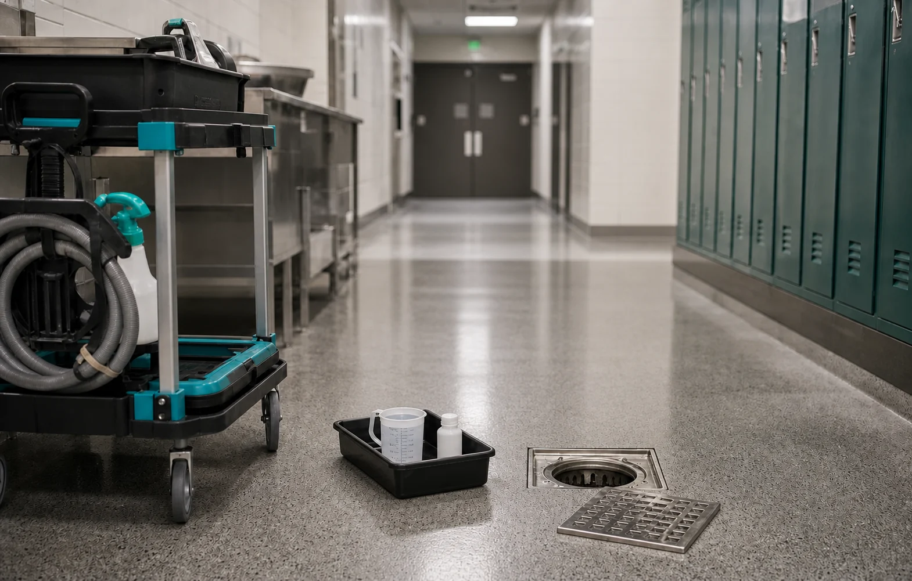

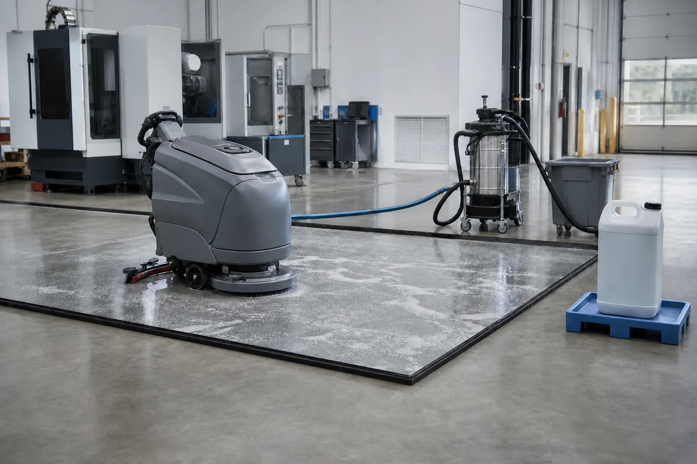

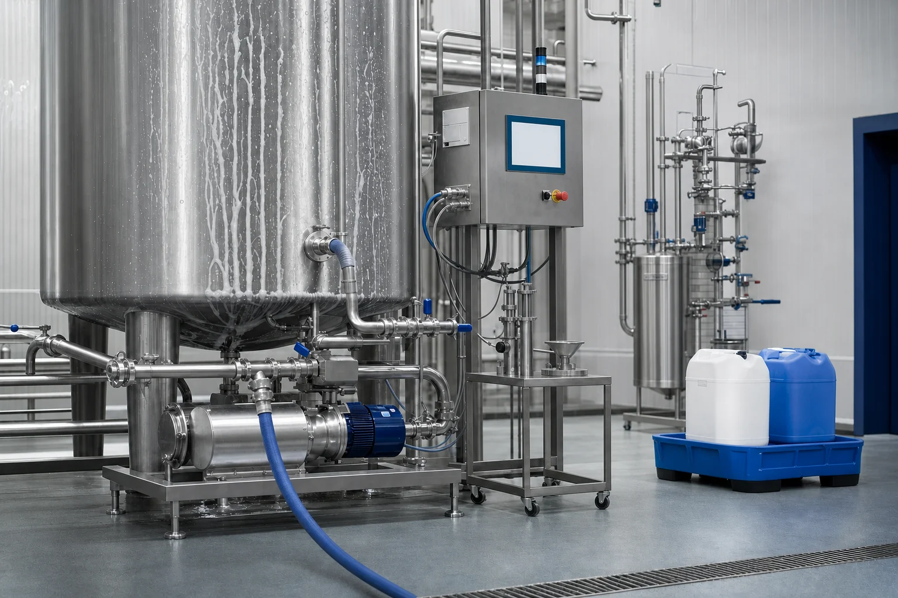

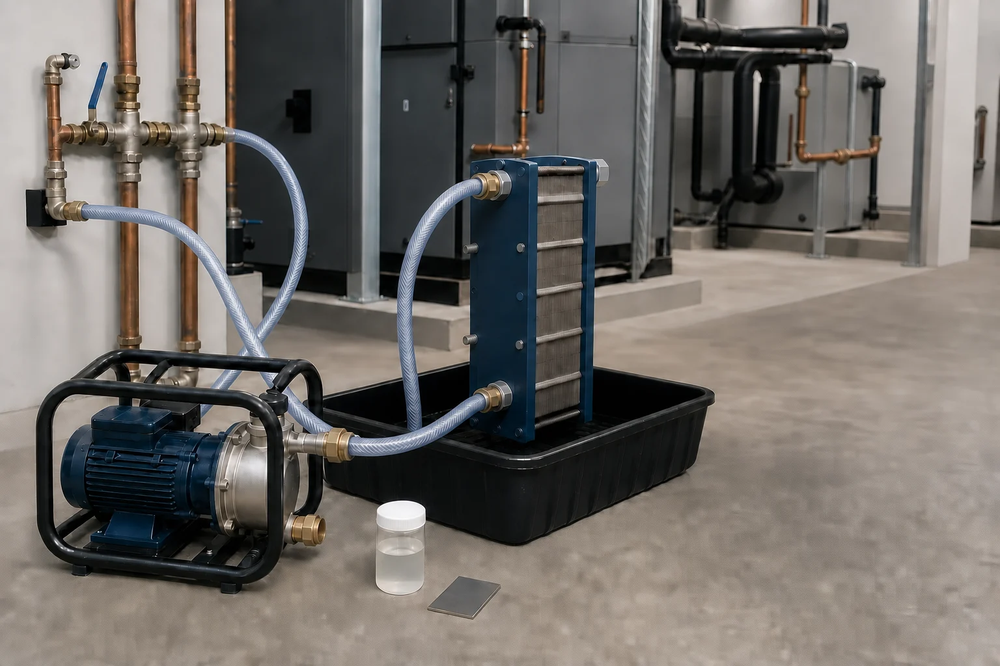

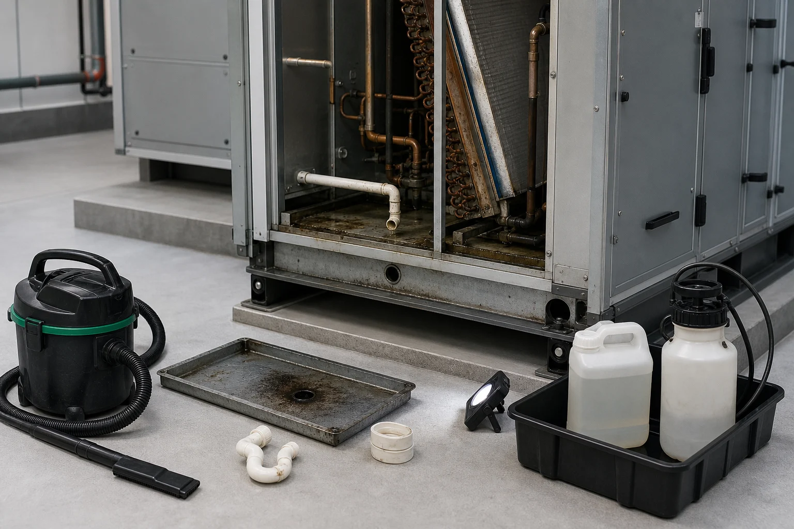

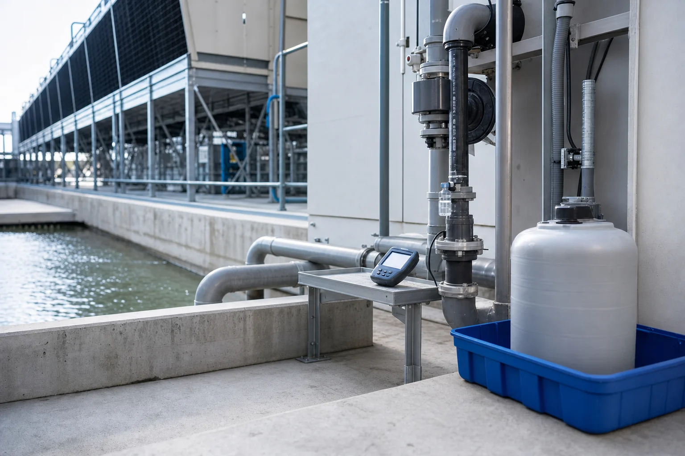

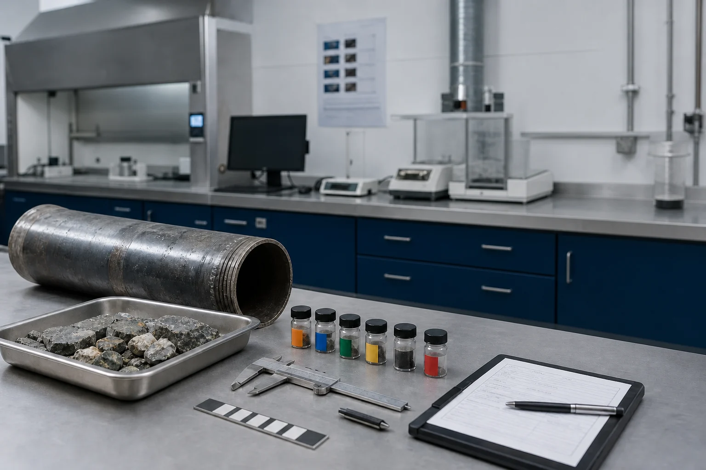

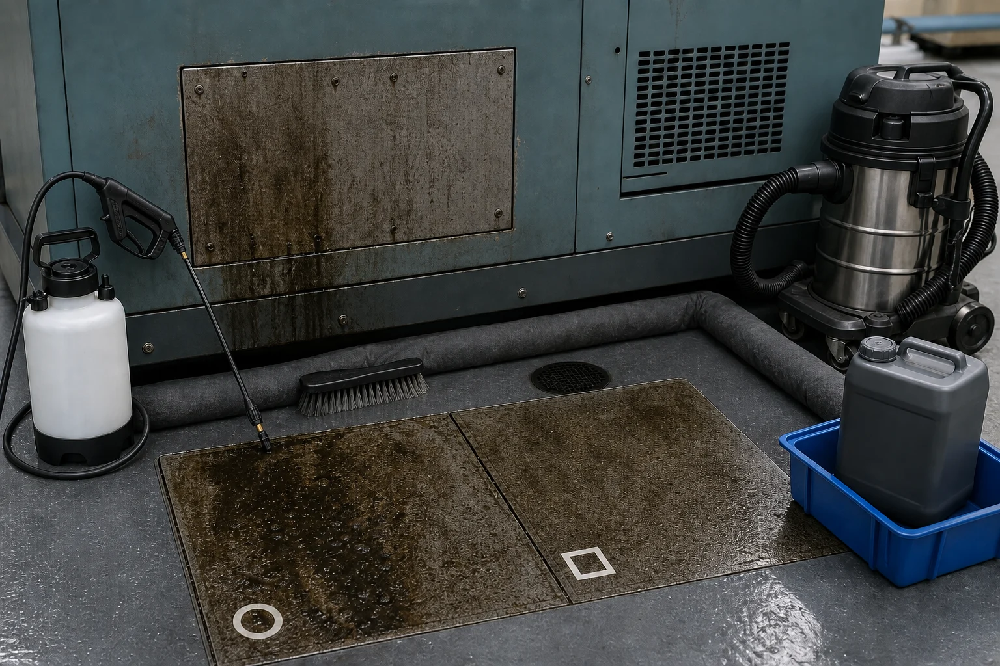

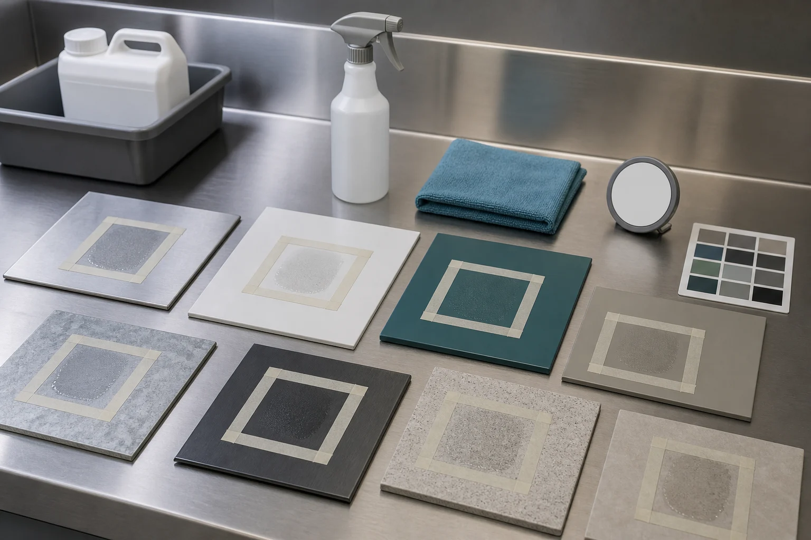

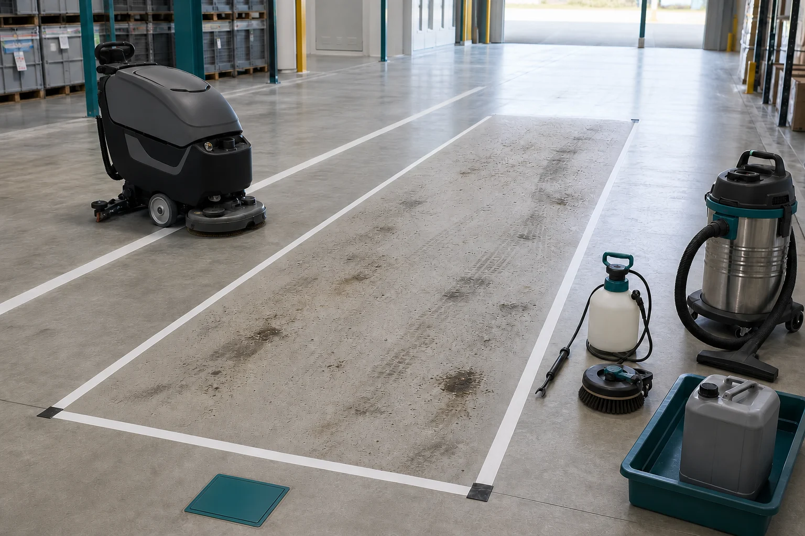

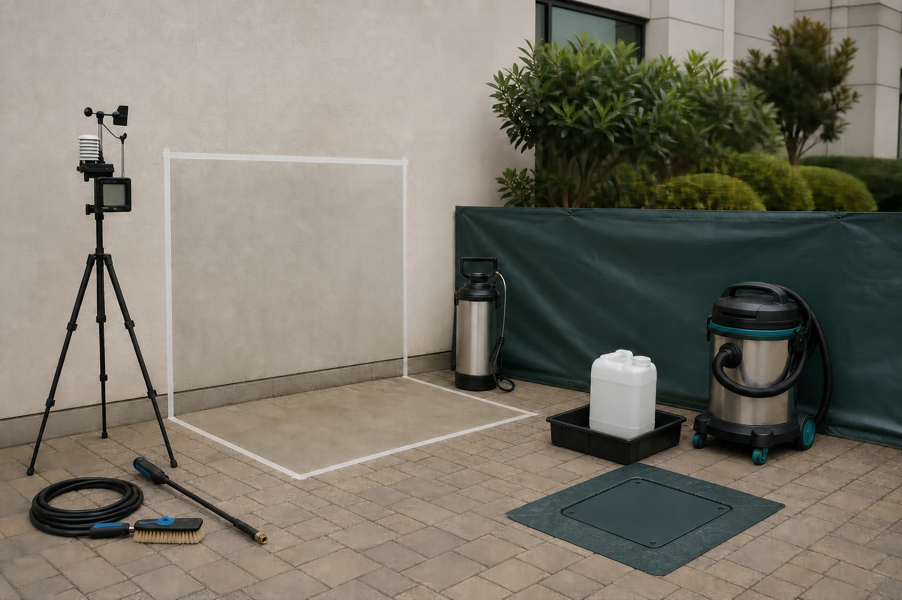

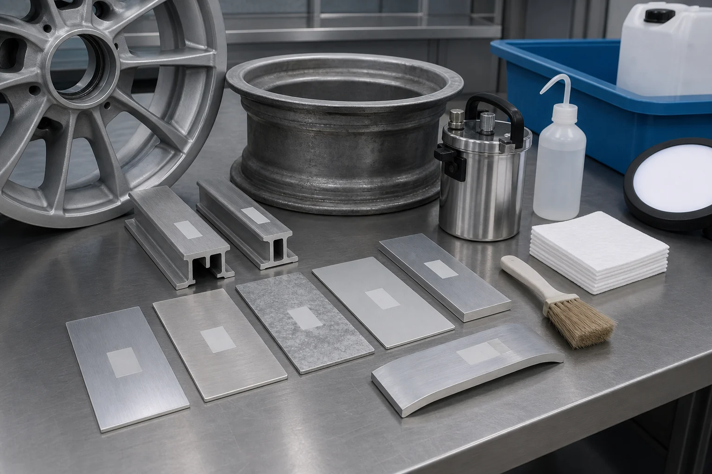

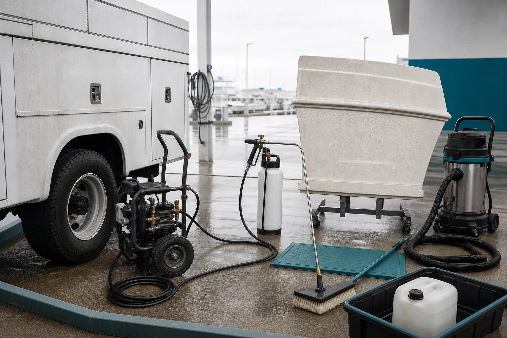

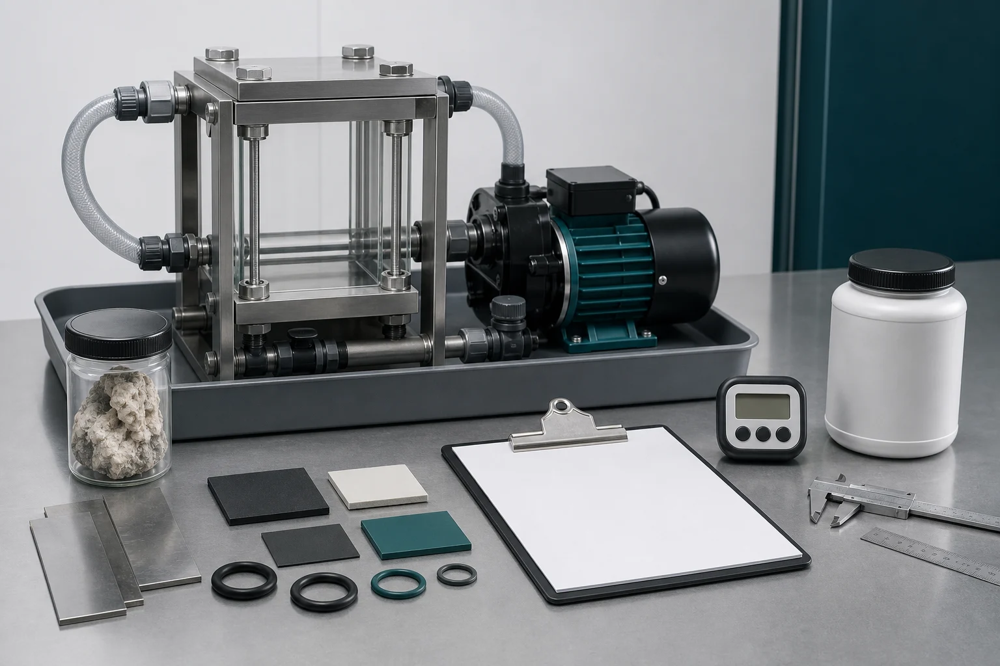

The reviewed assets contain no people, customer identity, certification mark, result
claim, or endorsement. Their public references use the existing managed-image manifest
and CMS path; generated imagery remains separate from proof.

## Ordered implementation candidates

1. **P4.1 — product differentiation and CTA cleanup — complete**
   - replace overlapping copy inside current canonical product data;
   - rename public “CR2” CTA to VertKleen HVAC CR;
   - replace eight generic “Request free sample” labels with job-specific actions;
   - preserve all existing quote behavior.
2. **P4.2 — controlled proof adjacency — complete for proven mappings**
   - deep-link each product only to approved mapped records;
   - show exact-product documents where controlled records exist;
   - do not infer variant equivalence for HVAC HCR, CR HD Low Foam, or AlumiBrite.
3. **P4.3 — service decision architecture — complete**
   - refine current category/card copy and lifecycle order;
   - preserve the 35 lines, four packages, pricing source, and shared quote flow;
   - clarify regulated terms such as certification, recertification, and Legionella
     testing without renaming authoritative workbook items.
4. **P4.4 — application image set — complete**
   - 15 representative, equipment-only assets cover every listed P0-P2 product and
     selected service scope;
   - publish only through the current managed-image path;
   - retain packshots as product identity, not sole persuasion.

## Definition of done

- all 15 public product names remain unchanged;
- no new product, route, form, payload, or evidence system;
- every product page explains a distinct job and buyer decision;
- every CTA routes through existing request types and captures only required context;
- every proof link is exact-product or explicitly bounded family/context evidence;
- services state inputs, deliverable, decision, and scope boundary;
- generated visuals are representative, accessible, and free of fabricated proof,
  customer endorsement, agency marks, unsafe work, or universal claims;
- public copy does not broaden exact-source safety, environmental, discharge,
  regulatory, certification, or use scope.
