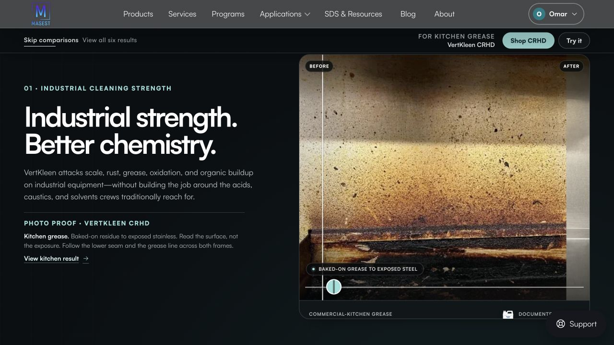
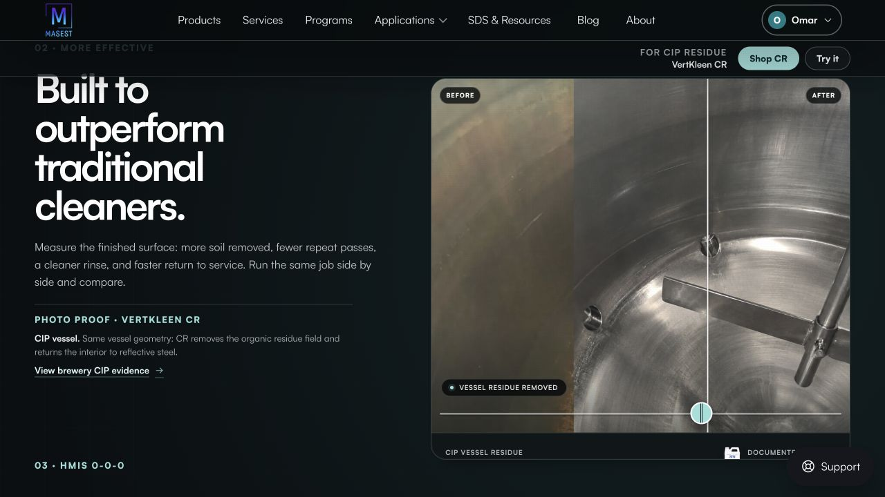
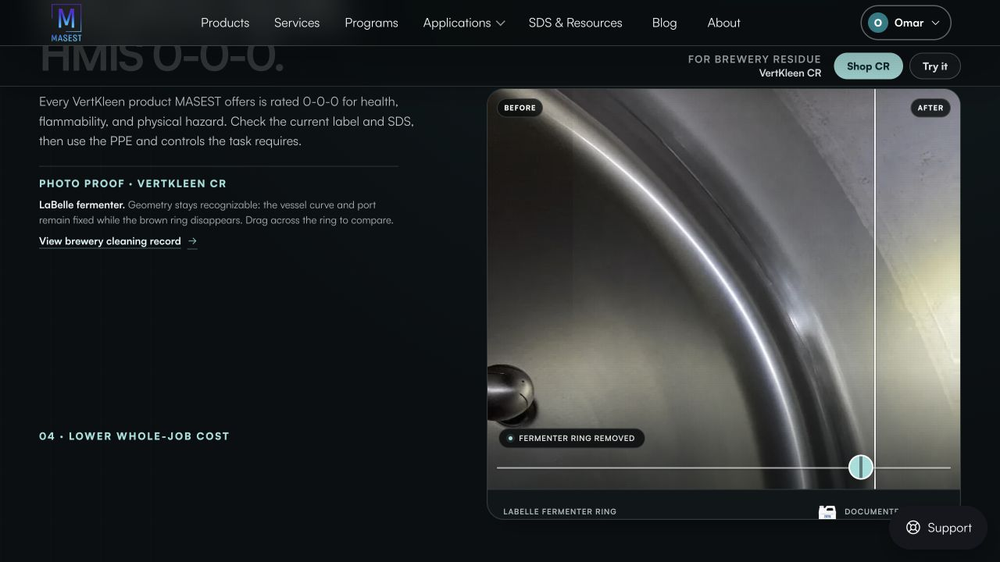
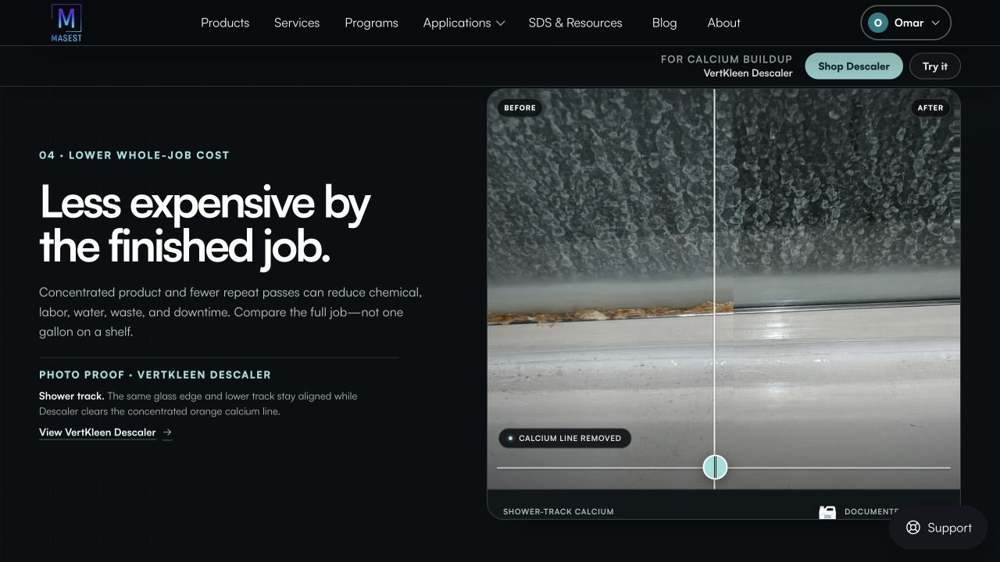
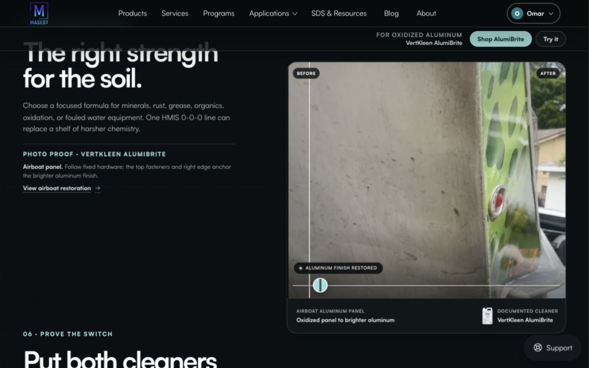
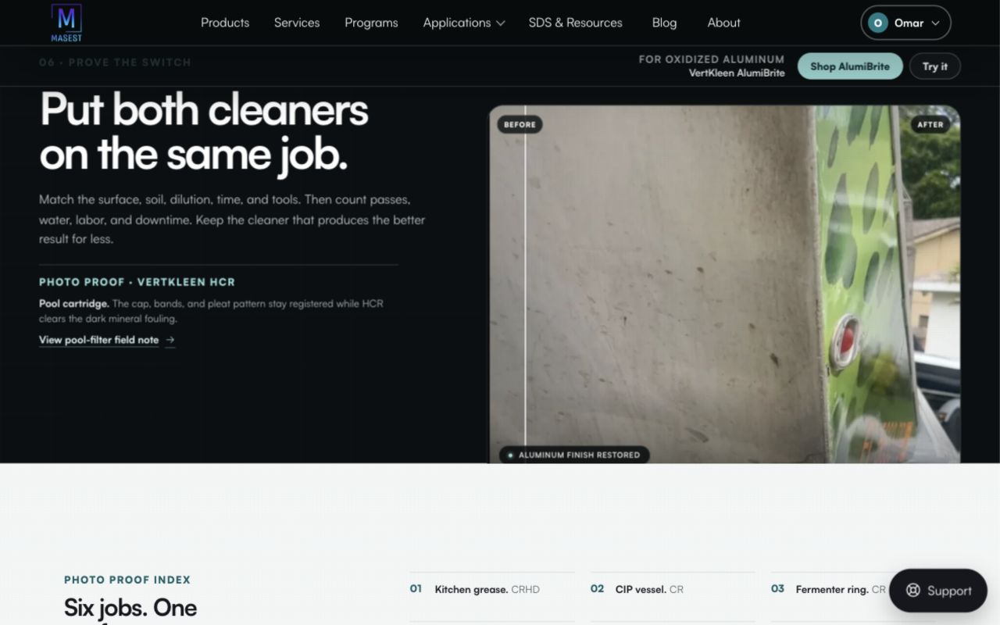
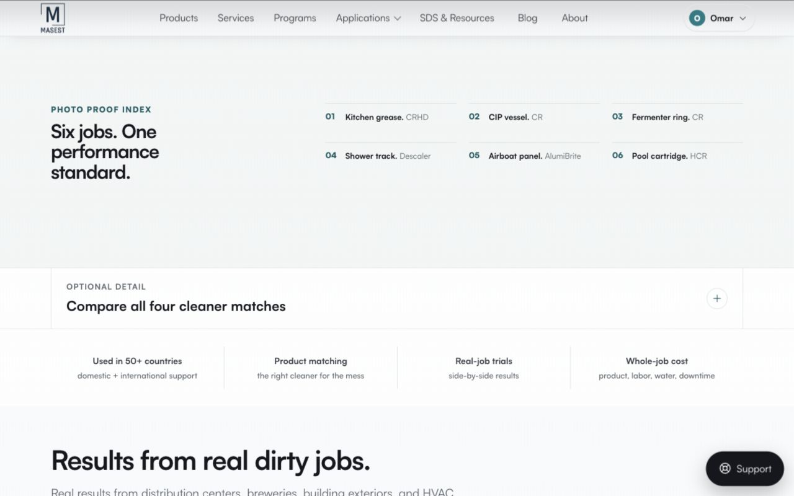
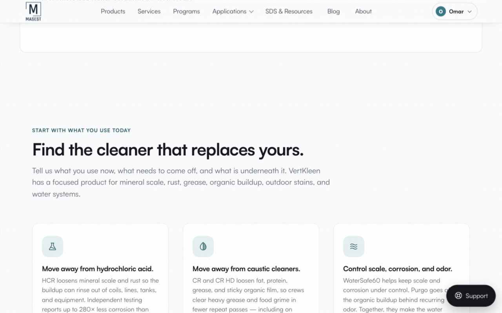
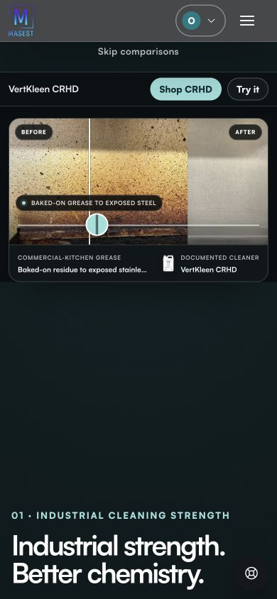
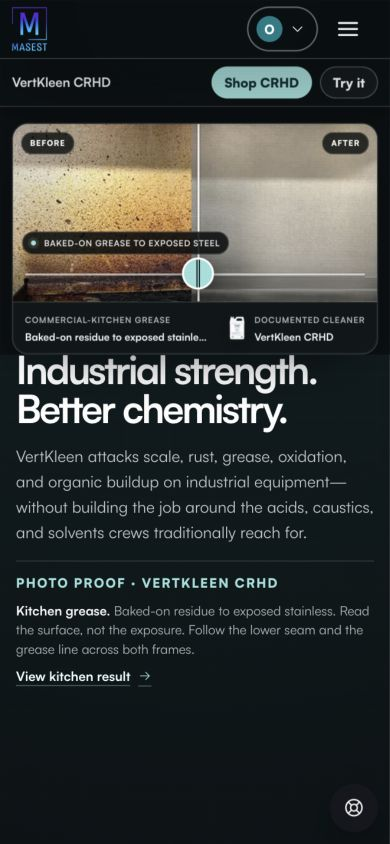

# MASEST landing page: simplify the buying journey

Reviewed live at https://masest.co/ on September 25, 2026.

**Recommendation: retire the six-scene scrolling opener. Replace it with a stable hero, product selection by cleaning job, one compact proof section, a short support section, and a final contact action.**

The strongest assets are already here: real cleaning photographs, specific products, technical documentation, and human support. The current presentation makes visitors process the animation system before they understand the offer. Refinement should come from fewer competing elements, clearer ordering, and consistent compositions.

## What makes it feel disorganized

### 1. Too many things change during one scroll

Scrolling advances the copy, changes the photograph, moves the before/after divider, changes the product name, and changes the shopping destination. Each mechanism may work individually; together they demand too much attention. The reader is also choosing between scrolling vertically and dragging horizontally.

**Change:** ordinary page scrolling. Give each result a fixed photograph pair, fixed caption, and fixed product link. If a comparison slider survives, make it an optional, manually operated interaction inside the proof section.

### 2. The page has competing centers of attention

The opening screen contains primary navigation, a separate sticky action bar, a skip link, a large headline, a body paragraph, a second proof paragraph, a result link, image labels, a status badge, a slider, a product footer, and support UI. The product's main shopping action is detached from the headline.

**Change:** one headline, one supporting sentence, one primary action, one secondary text link, one visual. Put actions directly under the message. Remove the second sticky bar.

### 3. The photograph and the argument often diverge

A fermenter cleaning photo accompanies an HMIS statement. A shower-track photo accompanies a whole-job cost statement. These photographs show visible cleaning outcomes; they do not establish hazard ratings or savings. The photo explanations also ask visitors to inspect seams, geometry, hardware, and exposure differences, giving the hero the tone of an evidence-review worksheet.

**Change:** pair cleaning photos with specific cleaning claims. Place hazard information beside applicable documentation. Discuss cost with a documented case or a controlled trial offer. Move detailed photo-comparison notes to the proof page.

### 4. Mobile hierarchy is inverted

At **390 × 844**, after a fresh load and verified `scrollY: 0`, the H1 starts at approximately **748px**. Navigation, skip control, shopping controls, and comparison imagery all precede the main proposition. A large empty interval separates the image and headline. The story alone measures approximately **5,169px** tall.

**Change:** headline → short explanation → actions → image. Use natural content height. Remove the sticky comparison stage from mobile.

### 5. The page restarts its sales pitch repeatedly

After six comparisons, visitors encounter a six-result index, an optional comparison panel, a trust strip, another results section, a program section, a replacement-selection section, and then featured products. The ingredients are useful; their repetition and order obscure the next decision.

**Change:** answer five questions once: What is this? Which product fits? Does it work? Can you support us? How do we start?

## Proposed five-section page

### 1. Stable hero — establish the offer

Keep the strongest existing line:

> **Industrial strength. Better chemistry.**
>
> VertKleen cleaners for scale, rust, grease, and industrial buildup. Find the formula for your surface and cleaning job.
>
> **Find your cleaner** · Get product advice

Primary action leads to the job selector. Secondary action leads to contact. Use the existing authentic CR/HCR product photography if its quality supports a prominent crop. Keep labels readable. Do not use a dirty surface as the dominant opening image without immediate product context.

Desktop: balanced copy/image composition, aligned on one grid. Mobile: copy and actions first. One compact documentation/support line may sit beneath the actions; no row of competing badges.

### 2. Choose by cleaning job — make shopping easy

Use four clear routes already present in the catalog navigation:

- Rust & Scale
- Grease & Grime
- Exterior & Specialty
- Water Treatment

Each route gets one plain description and one action. Link to existing catalog categories. Avoid adding another questionnaire or complex finder at this stage. Keep a visible “Browse all products” link for buyers who know what they want.

### 3. One convincing proof section — demonstrate performance

Feature one strong, well-matched before/after pair with the same surface clearly recognizable. Keep both states visible by default, labeled **Before** and **After**. Include the job, the product, and a short factual outcome. Retain at most two smaller supporting results, then link to the full proof library.

Use the best available evidence, not a fixed quota of six. Keep original photos. Do not fabricate performance numbers or retouch evidence to exaggerate the result.

### 4. Procurement support — explain why MASEST

Combine product matching, a controlled trial, training, and resupply into one short section. Use concrete language:

> **A product match. A trial plan. Ongoing supply.**
>
> Tell us your soil, surface, equipment, and current cleaner. We can help choose a formula and plan the next step.

Link deeper program details from here. Keep industry lists and distributor recruitment on their dedicated routes or in secondary navigation.

### 5. Final contact action — close with one decision

> **What needs to come off?**
>
> Tell us about your cleaning job. We’ll help you find the right VertKleen product.
>
> **Get product advice**

Keep “Get a quote” available for ready buyers. Place distributor recruitment outside the primary conversion block.

## Visual and motion rules

- Keep the current typography and restrained teal accent. Use accent color for the primary action and selected states.
- One dominant background through the main journey. If the dark hero stays, make one deliberate transition to the light body.
- Use one content grid, consistent left edges, consistent image ratios, and predictable section spacing.
- Reduce uppercase labels, numbered acts, nested captions, pill badges, card borders, and repeated dividers.
- Keep product identity visually stronger than comparison controls.
- Default content must be readable without animation. Never tie paragraph visibility to scroll progress.
- Allow brief hover/focus feedback and optional small section fades. Suggested starting range: 150–250ms; validate by feel.
- Remove scroll-driven image wipes, changing purchase destinations, long sticky stages, and staggered paragraph entrances.
- Reduced-motion mode should present the same complete content in ordinary flow. Keyboard focus must remain visible and stable.

**Small tuning of easing or spacing will not resolve the structural problem. Remove the six-scene mechanism first.**

## Capture walkthrough

These screenshots were captured and reopened during this audit. They document sampled states, not every animation frame. Initial desktop captures use 1280 × 720; later desktop captures use 1280 × 800. Mobile captures use 390 × 844. The browser was signed in, so account/support controls differ from an anonymous visit.

### 1. Desktop arrival — clear headline, crowded hierarchy

The headline reads well. Real photography gives the page substance. The detached action bar and dense proof annotations split attention.

### 2. CIP transition — weak continuity

The long headline occupies four lines. The scene label passes behind the sticky controls while the next scene's label enters below. The fixed photo and flowing copy do not read as one composed panel.

### 3. HMIS transition — weak claim/evidence pairing

The heading is partly behind the header. The following section label is already visible. The fermenter result illustrates cleaning, while the text addresses hazard classification.

### 4. Cost scene — composed layout, unsupported visual inference

This sampled state is relatively balanced. The shower image demonstrates removal of a visible line; it supplies no measurement of whole-job cost. Keep the outcome, relocate the cost argument.

### 5. Product-range transition — crowded boundary

The current headline passes behind the action bar while the next headline arrives at the bottom. The image remains fixed between two competing pieces of copy.

### 6. Final trial scene — observed content mismatch, needs reproduction

In this captured state after viewport changes and reverse scrolling, the copy names a pool cartridge and HCR while the image and shopping bar still show AlumiBrite. This is a concrete observed mismatch, not proof that every ordinary forward visit fails. Reproduce separately if retaining the current engine. A fixed association between photo, caption, and product removes this entire class of confusion.

### 7. Story exit — calmer presentation, repeated decision layers

The white section improves legibility. The six-job index, four-cleaner comparison, trust strip, and another results section create several restarts before product selection.

### 8. Lower product guidance — useful content appears late

“Find the cleaner that replaces yours” is closer to a buyer's task. Promote this function near the top; shorten the paragraphs and reduce the surrounding vertical separation.

### 9. Mobile arrival — priority issue

Verified scroll origin after fresh load. Main heading starts at approximately 748px in an 844px viewport. The blank gap consumes space without adding meaning.

### 10. Mobile reading state — sticky media competes with copy

At approximately 399px scroll depth, the comparison stage remains above the copy and the heading meets its lower edge. The small photo captions truncate. Reading room should take precedence over a persistent comparison control.

## Accessibility and evidence limits

Observed strengths: skip controls, a labeled range control, descriptive links in the accessibility tree, and meaningful headings. Visible risks: small secondary captions, sticky regions obscuring reading space, and content or controls changing with scroll. These are review findings, not a WCAG conformance verdict.

Full keyboard traversal, screen-reader announcements, measured contrast, reduced-motion behavior, anonymous-user rendering, checkout, and performance profiling were not tested. Claims about chemistry, HMIS ratings, cost savings, and field results were not independently validated. This audit concerns their presentation and evidence pairing. No analytics were reviewed; conversion effects are hypotheses to validate.

The local checkout contains existing edits in `index.html`, `css/story.css`, and `js/story.js`. Live observations must not be treated as verification of those uncommitted changes. No application code was changed, committed, or deployed for this review.

## Implementation boundary and acceptance criteria

Primary owners: `index.html` for page structure; `css/story.css` for story layout; `js/story.js` for comparison and scene behavior. Shared navigation and general tokens should change only where the chosen design requires it.

Current local source confirms that `automaticReveal()` maps scene progress from 8 to 92, and `renderScene()` applies it unless a manual value exists (`js/story.js:247–268`). `initDesktopStory()` combines scroll-triggered scene activation with staggered opacity/position reveals (`js/story.js:499–548`). The graph's initial snippet offsets were stale; these ranges were checked against the current file. They explain the implementation approach, not deployed-source parity.

Before accepting a replacement:

1. At 390 × 844, the headline, explanation, and primary action appear before the first major image.
2. At desktop and mobile sizes, normal scrolling reveals complete sections without blank animation spacers or overlapping sticky content.
3. Every visible result keeps its caption and product link together; scrolling never changes a visible button's destination.
4. Buyers reach cleaning-job selection immediately after the hero.
5. The page contains one proof section, one support section, and one closing conversion block.
6. Reduced motion and JavaScript failure preserve the essential message, navigation, and purchase routes.
7. Keyboard focus is visible; comparison controls, if retained, work without dragging.
8. Existing catalog, proof, SDS, contact, cart, and procurement routes continue to work.

Recommended next design decision: commit to this shorter page structure before choosing new animation or visual effects.
