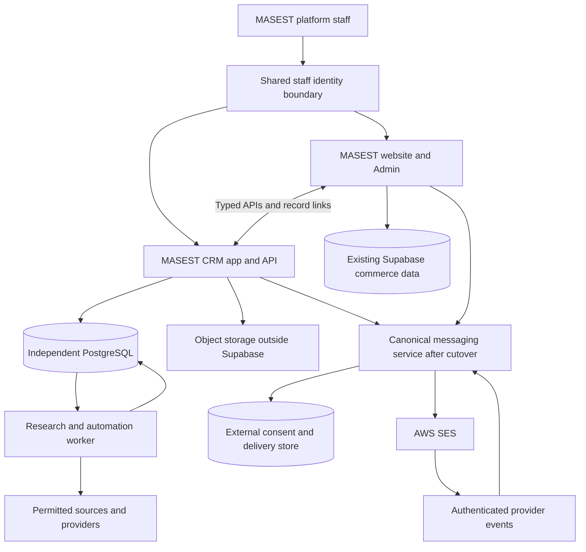

# Evolving OpenGTM into MASEST CRM

Status: architecture proposal for discussion, not an approved migration or release.
Implementation update: the user subsequently authorized the first local slice.
[Connected CRM intake acceptance](/Users/omar/Documents/Projects/twitter/opengtm/docs/masest-connected-crm-2026-09-25.md)
documents an Admin subview, per-request staff authorization, a signed server bridge,
and prospect CSV/search on independent PostgreSQL. It uses the existing Admin
session without creating a cross-domain browser session. Dossier/evidence views,
legacy migration, hosting and activation remain pending.
User direction: make OpenGTM part of MASEST through separate, connected apps.
**Revised constraint: no new CRM storage in Supabase. Move suitable existing
domains out incrementally rather than expanding that dependency.** The reason
and deadline for the possible Supabase shutdown remain to be clarified.

## Recommendation

Build **MASEST CRM as an independently deployable application**, reached from
MASEST Admin and joined through staff identity, navigation, typed record links and
APIs. Give it PostgreSQL outside Supabase for CRM records, jobs, evidence metadata,
budgets, audit history and automation. Store bulky imports, documents and source
snapshots in object storage outside Supabase, with hashes and references in CRM.

Keep OpenGTM's Python services and useful React UI as the starting application;
adapt branding, identity and commerce links instead of rewriting them into Pages
Functions. The website remains a separate commerce/admin app. A proposed address
is `crm.masest.co`; same-origin routing is an alternative to evaluate, not an
already configured route. Staff should have one sign-in experience, while the
applications retain clear deployment and data ownership boundaries.

MASEST already implements valuable authentication, CRM, nurture, SES delivery and
event processing. Reuse their contracts and code selectively. **Do not reuse a
Supabase-backed module unchanged if that makes new CRM activity write into
Supabase.** In particular, the SES transport can be retained, but its delivery,
consent and suppression persistence needs an external owner before new CRM
campaigns use it. Existing website workflows stay on their current owner until a
verified cutover; no parallel sender or competing consent authority is introduced.

The earlier recommendation to consolidate into Supabase is superseded.

## What exists in the two codebases

Source snapshot: MASEST `main` at `6896ede5`, with unrelated local changes;
OpenGTM `codex/crm-stabilization`, also with uncommitted work. This review did not
inspect the live MASEST database or authenticate into the live Admin. Checked-in
schemas are migration evidence, not proof of the deployed schema.

| Capability | MASEST ownership today | OpenGTM contribution |
| --- | --- | --- |
| Admin and access | Lazy-loaded CRM workspace; validated Supabase user; platform staff roles/capabilities | Reuse behavior/UI ideas behind existing staff permissions |
| Prospects | `prospect_organizations`, `prospect_contacts`, import/source records, draft review, retention and explicit company linkage | Stronger CSV parsing, source observations, provenance, freshness and verification |
| Customers | `companies`, buyer `profiles`, company-owned `crm_contacts` | Enrichment and relationship views without creating duplicate customer masters |
| Sales | Quote-based pipeline, sample/audit stage, proposals, offers, orders, accounting and fulfillment | Exact-value summaries, revision/audit safeguards, bounded board patterns; independent opportunities only after a model decision |
| Follow-ups | `crm_notes`, `crm_tasks`, customer/contact/quote timelines and due-task handling | Richer task lifecycle, stale-write protection, evidence-triggered follow-ups |
| Marketing | Canonical preferences/suppression, three-message quote nurture, SES worker, delivery ledger, SNS events | Audience/evidence rules, durable automation definitions and outcome review |
| Research | Bounded prospect metadata and source hashes | Discovery adapters, evidence review, qualification, budgets and enrichment waterfall; live provider wiring still needs work |

Source anchors: [Admin CRM mount](../../js/admin.js),
[CRM workspace](../../js/admin/crm-workspace.js),
[prospect UI](../../js/admin/crm-prospects.js),
[staff authentication](../../functions/_lib/supabase.js),
[capabilities](../../functions/_lib/authz.js),
[pipeline helpers](../../functions/_lib/crm-pipeline.js),
[email architecture](../email-architecture.md),
[quote nurture](../../functions/_lib/marketing-nurture.js).

## Proposed architecture

This is the target after the messaging cutover, not the currently connected
system. Separate CRM/messaging schemas may share one externally hosted PostgreSQL
cluster initially; separate applications do not require a database server per
module. No host or storage provider is selected by this proposal. Supabase's
remaining commerce/auth responsibilities can migrate later through separate
cutovers. No browser or provider payload may select a trusted workspace or actor.

### Data ownership

1. **One owner per business object.** New prospects, research, tasks and sales
   opportunities live in the external CRM. Existing website Companies, buyers,
   quotes and orders remain website-owned until their own migration. Preserve
   primary keys and explicit links. Store the typed crosswalk in the external
   database; OpenGTM UUIDs, prospect UUIDs and customer-contact bigint IDs cannot
   be blindly cast or matched by email/domain/name. Imported prospects do not
   create portal accounts.
2. **One workspace represents MASEST's internal CRM.** A customer Company is not
   an OpenGTM workspace. Treating every buyer Company as a workspace would confuse
   customer membership with staff CRM tenancy and could expose prospect data.
3. **No new CRM-owned Supabase rows.** Imports, evidence, jobs, embeddings, audit
   logs, activity, campaign recipients, delivery attempts and synchronization
   checkpoints belong outside Supabase. Do not add mirror tables, per-lead
   triggers, or a Supabase outbox for the new app. Necessary writes from existing
   website workflows continue until their domain moves; that is not permission
   to funnel new CRM load through them.
4. **Keep OpenGTM's PostgreSQL safeguards.** Use a non-owner application role,
   authenticated transaction context, workspace-scoped rows, composite foreign
   keys and forced RLS in the new store. Cross-database links require explicit
   API validation and reconciliation; they cannot have ordinary cross-database
   foreign keys. Current Supabase service-role behavior is not an equivalent
   access model and should not be copied into the new worker.
5. **One consent and delivery authority throughout cutover.** Existing MASEST
   preferences and SES ledger remain authoritative until exported, reconciled and
   switched to an external messaging service. Move that domain early, before
   activating new CRM campaigns. Update website preference writes and SES event
   ingestion together. An unavailable authority blocks sends; a stale copied
   opt-in must never overrule an unsubscribe. Reuse SES transport and event logic,
   but never run both old and new consumers for the same delivery intent.
6. **Commerce remains authoritative.** Quotes, accepted offers, orders, payment,
   refunds, shipments and QBO transitions stay in their existing services. CRM
   consumes links/events and invokes those services; a CRM stage change cannot
   manufacture a paid order or bypass quote approval.

### Existing ADR to preserve and, if needed, amend

[ADR 0001](../adr/0001-separate-prospect-domain.md) explicitly separates imported
prospects from Companies, buyer accounts and customer contacts. Imported consent
is unknown. Prospect conversion requires explicit `linked_company_id`.

It also explicitly limits prospect outreach to reviewed manual `mailto:` drafts.
**Automated prospect email would change that accepted decision.** A future ADR
must define enrollment authority, allowed audiences, suppression precedence,
review boundaries and integration with the existing delivery ledger. This
proposal does not enable it. Existing consent-gated customer/quote nurture can
continue under its current contract.

### API and UI integration

Add an Admin entry point into the CRM application, with links back to exact
company, quote, order and support records. A small authenticated integration API
supplies bounded commerce context; it does not proxy all CRM persistence through
Supabase. Keep legacy `/api/admin/crm/*` responses stable during transition and
switch each record's write owner once its migration is accepted.

Initially, existing staff identity can be verified server-side and exchanged for
a short-lived, audience-bound CRM session; this must not create new Supabase user
or session tables. Recheck roles and revocation, validate the actual token/signing
configuration and enforce platform-staff capabilities. Do not share service-role
keys, broad domain cookies or accept an email address as authentication. If full
Supabase retirement is intended, identity needs its own migration early enough
that the joined apps do not depend on a terminated authentication service.

New CRM routes retain explicit capability checks, attributed actors, bounded
pagination, idempotent mutations and optimistic revisions. Fetch commercial
details on demand or retain minimal externally stored projections. No live SQL
joins across the two databases, full-table polling loops or unrestricted two-way
sync. Prefer existing application events where available, with externally stored
checkpoints and bounded reconciliation for missed events; lack of a reliable
change feed is a migration gap to prove, not a reason to invent consistency.

New worker commands carry immutable job identity and bounded metadata. The
server resolves the record, source rights, workspace and budget. Results include
provenance, verification, cost and outcome; malformed or stale results fail closed.
Absence of evidence stays unknown. A worker cannot approve its own outreach.

Keep the website Admin shell stable. Give the CRM app matching MASEST branding,
clear navigation and record deep links, while retaining its own build and release
cycle. Reuse OpenGTM's UI where useful rather than forcing a framework rewrite.
If a view is later embedded, scope its styles and session boundary explicitly.

## MASEST-specific operator experience

The CRM should answer: which industrial sites and people are worth pursuing,
what is known about their needs, what happens next, and what commercial outcome
followed?

Proposed views within the connected CRM application:

- **Today:** due follow-ups, overdue work, research awaiting review, stalled
  proposals and blocked automations.
- **Prospects:** organizations, facilities and people; source/evidence dossier;
  import review; research/verification status; explicit customer conversion.
- **Customers and contacts:** canonical company and buyer context, account-owned
  contacts, quotes, orders and support history in one relationship view.
- **Pipeline:** preserve the existing New → Qualified → Sample / Audit → Proposal
  → Won / Lost stages initially, with clear links to actual quote/offer records.
- **Campaigns and automation:** audience preview, consent exclusions, content
  approval, schedule, spend/volume caps, run history and clear pause/hold reasons.

Useful MASEST dimensions include industry, facility/site, procurement or
maintenance role, application/use case, relevant product family, sample/audit
status, expected consumption, quote value and next review/reorder date. These are
proposed fields, not facts to infer from scraped text without evidence.

One model decision remains important: OpenGTM has independent Deals; MASEST's
pipeline currently lives on Quotes. Do not convert every sales opportunity into
a buyer quote request. Initially read the existing quote pipeline; later decide
whether an independent Opportunity should link multiple quotes/orders. Adopt one
canonical sales model before migrating deal records or forecasts.

## Options and tradeoffs

| Option | Benefit | Cost / limit | Recommendation |
| --- | --- | --- | --- |
| Add CRM/research storage to Supabase | Initially fewer service boundaries | Increases the dependency and load the user wants to reduce | Rejected by revised constraint |
| Separate CRM app and PostgreSQL, joined to MASEST through identity/APIs | Isolates CRM growth, reuses existing engine/UI, supports incremental Supabase exit | Requires hosting, an identity bridge and explicit data-owner cutovers | Preferred staged path |
| Move the entire website, auth and commerce database immediately | Removes Supabase dependence in one cutover | Broadest risk across checkout, payments, support and access; difficult rollback | Consider only after dependency inventory and rehearsal |

No monetary estimate is justified until workload, provider choices and worker
host are selected. The preferred path adds an independent database/application
runtime while reducing Supabase load and dependence. A workstation can support
development but does not by itself prove unattended production availability.

## Proposed implementation sequence

These are candidate slices for review, not published implementation assignments.
MASEST's canonical issue tracker is GitHub Issues for `OJamals/masest`; when
implementation is requested, record tasks there. Existing MASEST
`tasks/plan.md`/`tasks/todo.md` cover other unfinished work and remain untouched.

| Slice | Bounded change | Acceptance / verification |
| --- | --- | --- |
| 1. Storage and dependency inventory | Read-only inventory specification, retention/data-owner map and export manifest; about 3 files | Identify actual Supabase capacity/shutdown constraint; separate CRM, messaging, auth and commerce; no production rows changed |
| 2. Independent CRM foundation | External PostgreSQL configuration, restricted role/migration entry point and DB tests; about 4 files | Existing CRM contracts work without Supabase; rows isolated; backups/restores tested; bulky evidence outside DB |
| 3. Joined access | Staff session bridge, CRM auth middleware, Admin entry point and tests; about 4–5 files | Buyer/company-admin denied; revocation enforced; CRM opens from Admin; no Supabase persistence added |
| 4. External prospect intake | CRM import API/UI, shared CSV cases and integration tests; about 4–5 files | Improved CSV/evidence contract retained; zero writes to Supabase during CRM-only flow |
| 5. Intelligence jobs | CRM job service, research worker/result contract and tests; about 4 files | Durable job and evidence entirely external; exact replay; stale/unknown outcomes held |
| 6. Legacy prospect migration | Read-only exporter, typed crosswalk importer and reconciliation tests; about 3–4 files | Existing prospect identities/provenance/opt-outs survive; no automatic customer creation; old owner drained at cutover |
| 7. Contact and follow-up migration | Separately bounded contact and task/note slices, each migration/adapter/tests within about 3–5 files | External CRM owns migrated records; historical links remain; no competing writers |
| 8. Commercial context | Read-only commerce API contract, bounded projection adapter and tests; about 3–4 files | Customer/quote/order truth stays website-owned; checkpoints outside Supabase; stale context is explicit |
| 9a. Consent migration | External preference/suppression store, export/reconcile tools and tests; about 4–5 files | All sources and opt-outs reconciled; stale events cannot restore consent; old preference writer fenced |
| 9b. Delivery persistence migration | Adapt existing SES ledger/event persistence to external store; contract, adapter and tests; about 4–5 files | One ledger/consumer per intent; active attempts drained; unknown outcomes preserved; new CRM sends cannot write Supabase |
| 9c. Nurture activation | ADR amendment if needed, canonical enrollment adapter and end-to-end tests; about 3–4 files | Exact approved audience, reply/opt-out stops and provider receipts; uses migrated messaging service |
| 10. Remaining Supabase exit | Separate plans for auth, commerce and support after inventory | Each domain has backup, rehearsal, count/hash/permission proof and reversible application cutover before any deletion |

Checkpoint after slices 1–4: Admin opens the MASEST-branded CRM, which imports and
reviews a synthetic prospect using only independent storage. After 5–8: research
and migrated follow-ups work, with read-only links into website commerce. Before
9c: consent and delivery storage have moved and their single-owner cutovers are
verified. Split any slice further if it exceeds its stated file scope.

**Recommended first deliverable:** a separately running MASEST CRM app, opened
from Admin through verified staff access, with prospect import/evidence review on
independent PostgreSQL. Prove no CRM-only operation writes into Supabase. No
automatic customer creation, prospect subscription or email sending.

## Migration and acceptance safeguards

- Inventory actual OpenGTM records before any transfer; distinguish synthetic
  fixtures from permitted real data. Never bulk-copy pilot fixtures into MASEST.
- Preserve original IDs in a durable crosswalk and immutable import manifest.
  Reconcile counts, provenance, associations, tasks and unresolved provider state.
- Freeze or drain each old write owner before its cutover. During transition,
  legacy storage is an import source or explicitly limited job store, never a
  second customer/consent master.
- Do not apply OpenGTM migrations to Supabase. Reuse/adapt them only in the
  independent CRM database with the existing checksum/recovery discipline.
- Compare the SES ledger's crash, retry and unknown-outcome behavior with the
  OpenGTM outbox before bridging either. Existing implementation is not a promise
  of exactly-once provider delivery.
- Extend MASEST's real API/DB/browser acceptance flow and local verification
  gates. Source-level tests or a rendered mock do not prove database isolation,
  deployed provider events or a working unified operator flow.
- Preserve OpenGTM's LICENSE and relevant notices when code moves. Rebrand the
  retained app and retire superseded website CRM write paths only after parity.
- Reclaim Supabase space only after verified external persistence, backups,
  retention review and concrete authorization for deletion. Do not delete records
  merely because an export command returned success. Watch Supabase read/egress
  load during migration as well as stored bytes.

Open decisions: Supabase's actual limiting resource or retirement deadline,
independent app/PostgreSQL/object-storage host, interim and final identity owner,
independent Opportunity versus quote-only pipeline, initial enrichment provider,
and whether first production scope includes prospect outreach or only permitted
customer/quote nurture. None of these choices allows new CRM storage in Supabase.

## Review boundary

The initial architecture review changed documentation only. The subsequent local
intake implementation is documented in the linked acceptance report and includes
application code, a CRM PostgreSQL migration and synthetic tests. No production
data, running operator service, AWS service, email configuration or deployment
changed. MASEST's unrelated dirty files, including in-progress SNS changes, remain
preserved. No Supabase CRM records or schema were added.
